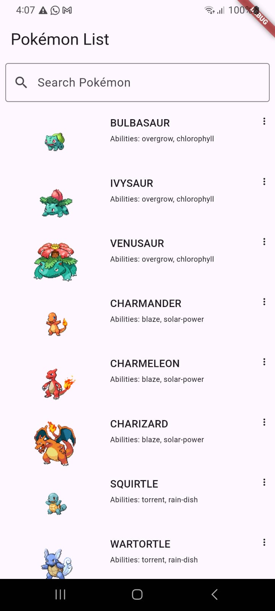

# Lista Pokémones - FrontEnd Flutter Móvil

Un nuevo proyecto de Flutter centrado en mostrar datos de Pokémon e implementar una pantalla de presentación animada.

## Features

- Pantalla de presentación animada con el logotipo de Pokémon.
- Lista de Pokémon obtenida de la API de Pokémon.
- Función de búsqueda para filtrar Pokémon por nombre.
- Interfaz de usuario hermosa y clara que sigue las mejores prácticas de Flutter.

## Screenshots

| APP de las lista de Pokémon  | Splash Screen Animado  |
|------------------------------|------------------------|
|  |  |

| Página de Inicio  | Función de Búsqueda  |
|-------------------|----------------------|
|  |  |

| Lista de Pokémon  |
|-------------------|
|  |

## Getting Started

This project is a starting point for a Flutter application.

A few resources to get you started if this is your first Flutter project:

- [Lab: Write your first Flutter app](https://docs.flutter.dev/get-started/codelab)
- [Cookbook: Useful Flutter samples](https://docs.flutter.dev/cookbook)

For help getting started with Flutter development, view the [online documentation](https://docs.flutter.dev/), which offers tutorials, samples, guidance on mobile development, and a full API reference.
